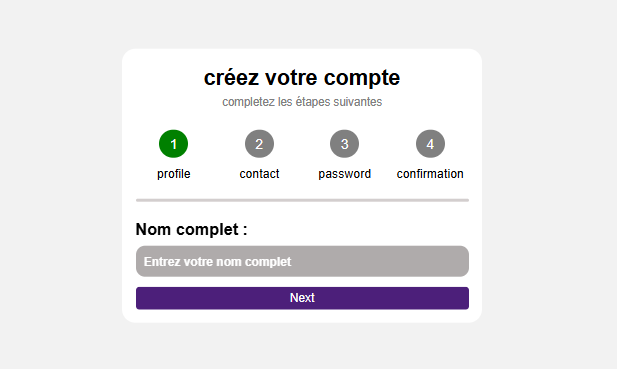

  

  
  

---

### 📖 Description
A **multi-step form** that splits long forms into smaller, easy-to-follow steps.  
It includes step validation, a progress indicator, and a responsive design to ensure a smooth user experience across all devices.  

### <a name="tech-stack">⚙️ Tech Stack</a>

- HTML5
- CSS3
- JavaScript

🔗 **Live Demo:** [Try it here](https://multi-step-form-nine-sandy.vercel.app/)
